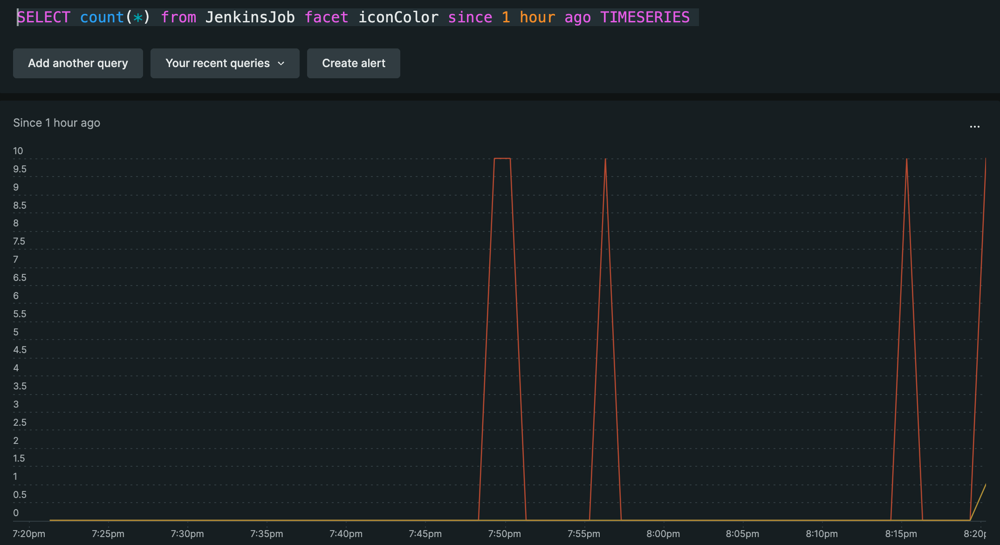
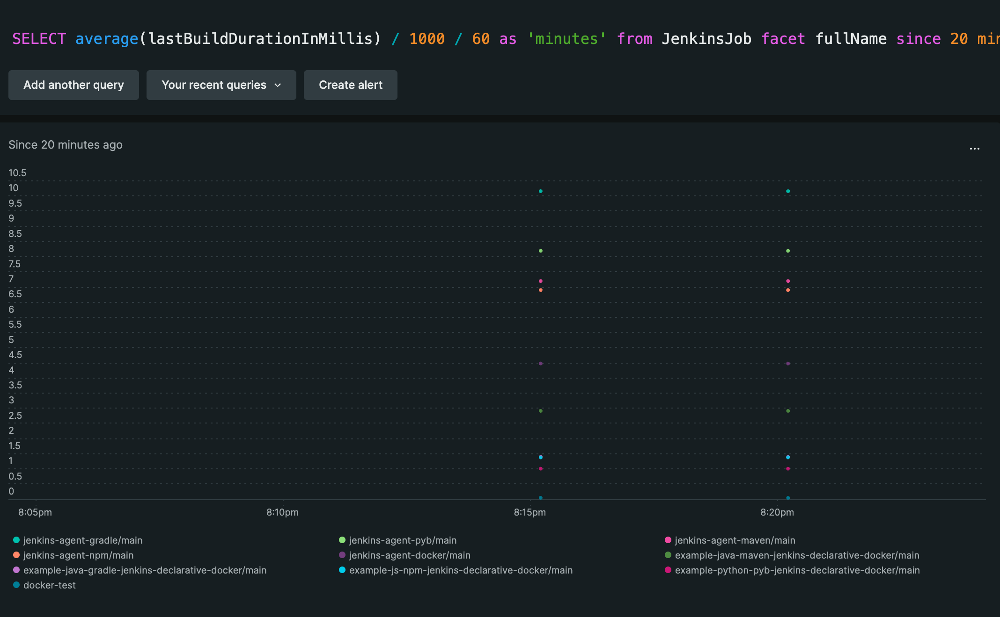
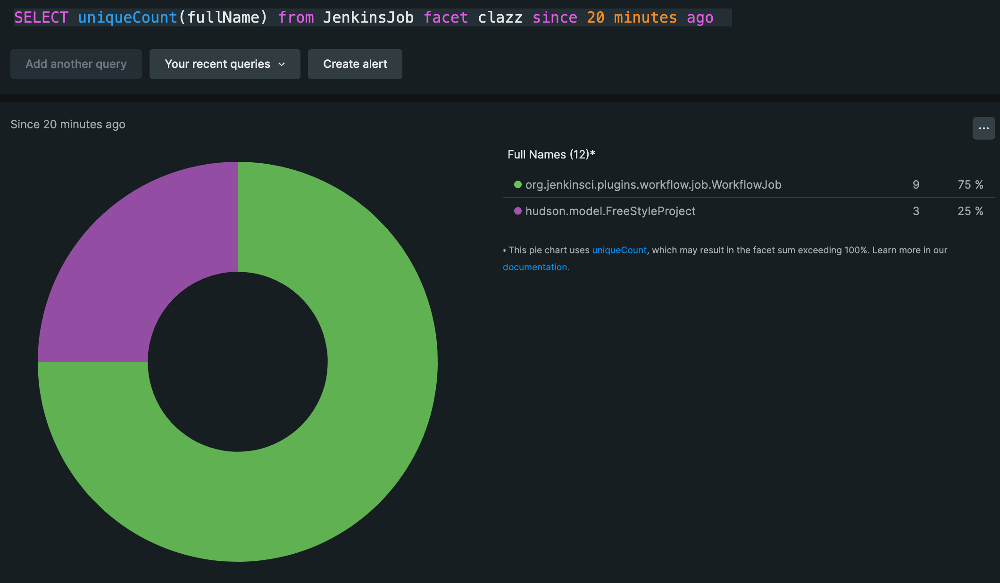
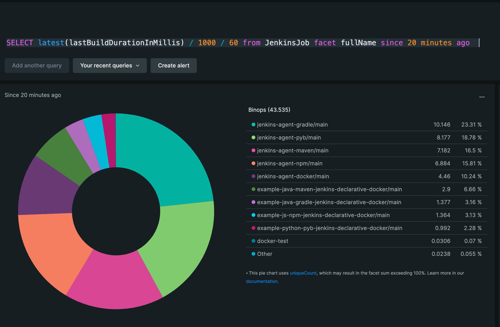
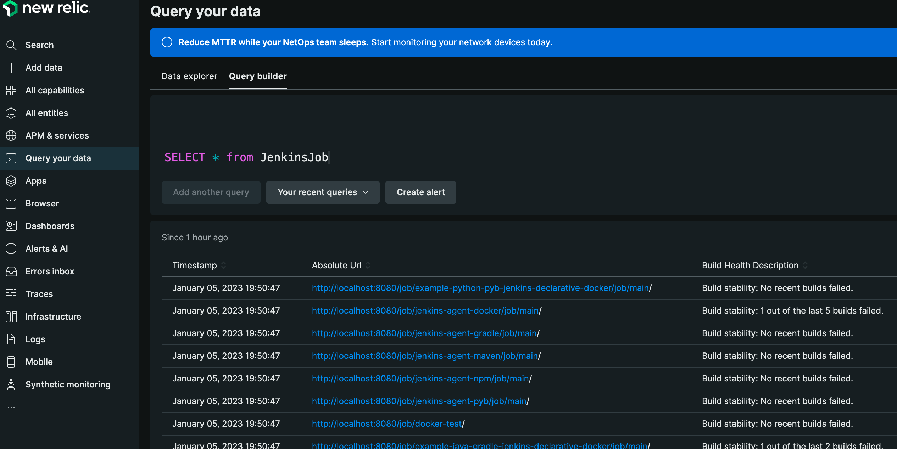
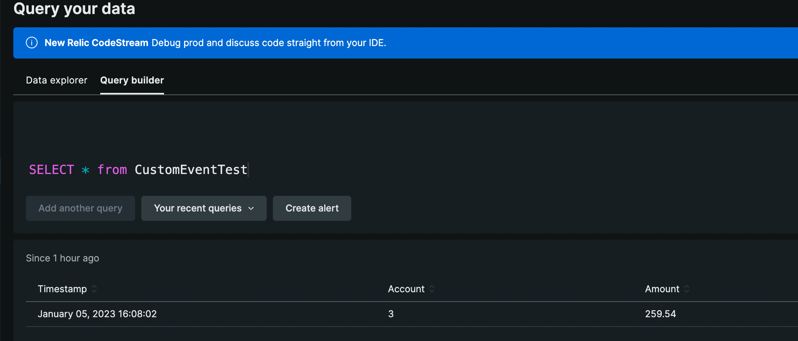

# Groovy-Gradle Jenkins Admin

This application demonstrates how to execute a Groovy script remotely via a Java Application to obtain all job information on a Jenkins instance, and then to post that information to New Relic as a series of events. The reason for doing this is that it gives you a means of monitoring the health of Jenkins at the job level, which is not a current default capability.

# Prerequisites

- A New Relic Account: https://newrelic.com
- The API Key you get when you first create a new Relic account
- The Account ID for your new relic account, which is the the URL when you are logged in
- A Jenkins API Token (See https://github.com/jvalentino/example-jenkins-docker-jcasc-2)

# Running It

You have to use the following command where you pass in your Jenkins username, Jenkins token, New Relic Account ID, and New Relic Token:

```bash
gradle \
  -DJENKINS_USERNAME="admin" \
  -DJENKINS_TOKEN="***" \
  -DJENKINS_URL="http://localhost:8080" \
  -DNEW_RELIC_ACCOUNT_ID="***" \
  -DNEW_RELIC_KEY="***" \
  run --stacktrace
```

# Querying the Data

The purpose of doing this is so that you have a periodic means of knowing the state of Jenkins job.

## Job Status Over Time

```sql
SELECT count(*) from JenkinsJob facet iconColor since 1 hour ago TIMESERIES 
```



## Build Duration Over Time

```sql
SELECT average(lastBuildDurationInMillis) / 1000 / 60 as 'minutes' from JenkinsJob facet fullName since 20 minutes ago TIMESERIES 
```



## Current Job Type Makeup

```sql
SELECT uniqueCount(fullName) from JenkinsJob facet clazz since 20 minutes ago  
```



## Which jobs take the longest to run?

```sql
SELECT latest(lastBuildDurationInMillis) / 1000 / 60 from JenkinsJob facet fullName since 20 minutes ago  
```



# Running it on Jenkins

If you are running via https://github.com/jvalentino/example-jenkins-docker-jcasc-2 locally, you will need to use your local IP address instead of localhost. This is because localhost in the context of the container agent is that agent, and not the Jenkins host.

```bash
gradle \
  -DJENKINS_USERNAME="admin" \
  -DJENKINS_TOKEN="***" \
  -DJENKINS_URL="http://192.168.1.43:8080" \
  -DNEW_RELIC_ACCOUNT_ID="***" \
  -DNEW_RELIC_KEY="***" \
  run --stacktrace
```

Otherwise this is just executed on the Gradle Agent (https://github.com/jvalentino/jenkins-agent-gradle):


# How does this work?

## Remote Script Execution

It starts by executing this Groovy script via the Jenkins REST API, which collected all the jobs with their stats, and outputs them as JSON:

scripts/list-jobs.groovy

```groovy
import groovy.json.JsonBuilder

List jobs = [];
Jenkins.instance.getAllItems(Job.class).each {
    def buildHealth = it.buildHealth
    Map job = [
            fullName: it.fullName,
            absoluteUrl: it.absoluteUrl,
            description: it.description,
            displayName: it.displayName,
            name: it.name,
            clazz: it.class.getName(),
            pronoun: it.pronoun,
            searchName: it.searchName,
            searchUrl: it.searchUrl,
            url: it.url,
            buildHealthDescription: buildHealth.description,
            buildIcon: buildHealth.iconClassName,
            buildScore: buildHealth.score,
            iconColor: it.iconColor.toString(),
            working: it.iconColor.toString().startsWith('blue') ? 1 : 0,
    ]
    jobs.add(job)
}

println new JsonBuilder(jobs).toString()
```

## Storing the Job Output

The result of the jenkins scirpt executing is then stored locally in memory, and also output to the file system for easier debugging in pretty format:

build/list-jobs.groovy

```json
[
    {
        "fullName": "docker-test",
        "absoluteUrl": "http://localhost:8080/job/docker-test/",
        "description": "",
        "displayName": "docker-test",
        "name": "docker-test",
        "clazz": "hudson.model.FreeStyleProject",
        "pronoun": "Project",
        "searchName": "docker-test",
        "searchUrl": "job/docker-test/",
        "url": "job/docker-test/",
        "buildHealthDescription": "Build stability: No recent builds failed.",
        "buildIcon": "icon-health-80plus",
        "buildScore": 100,
        "iconColor": "blue",
        "working": 1,
        "lastBuildTime": "2023-01-03T14:00:33+0000",
        "lastBuildDurationInMillis": 1834
    },
    {
        "fullName": "example-java-gradle-jenkins-declarative-docker/main",
        "absoluteUrl": "http://localhost:8080/job/example-java-gradle-jenkins-declarative-docker/job/main/",
        "description": null,
        "displayName": "main",
        "name": "main",
        "clazz": "org.jenkinsci.plugins.workflow.job.WorkflowJob",
        "pronoun": "Pipeline",
        "searchName": "main",
        "searchUrl": "job/main/",
        "url": "job/example-java-gradle-jenkins-declarative-docker/job/main/",
        "buildHealthDescription": "Build stability: 1 out of the last 2 builds failed.",
        "buildIcon": "icon-health-40to59",
        "buildScore": 50,
        "iconColor": "blue",
        "working": 1,
        "lastBuildTime": "2023-01-04T22:59:25+0000",
        "lastBuildDurationInMillis": 82648
    },
    {
        "fullName": "example-java-maven-jenkins-declarative-docker/main",
        "absoluteUrl": "http://localhost:8080/job/example-java-maven-jenkins-declarative-docker/job/main/",
        "description": null,
        "displayName": "main",
        "name": "main",
        "clazz": "org.jenkinsci.plugins.workflow.job.WorkflowJob",
        "pronoun": "Pipeline",
        "searchName": "main",
        "searchUrl": "job/main/",
        "url": "job/example-java-maven-jenkins-declarative-docker/job/main/",
        "buildHealthDescription": "Test Result: 0 tests failing out of a total of 2 tests.",
        "buildIcon": "icon-health-80plus",
        "buildScore": 100,
        "iconColor": "blue",
        "working": 1,
        "lastBuildTime": "2023-01-04T23:06:27+0000",
        "lastBuildDurationInMillis": 173975
    },
    {
        "fullName": "example-js-npm-jenkins-declarative-docker/main",
        "absoluteUrl": "http://localhost:8080/job/example-js-npm-jenkins-declarative-docker/job/main/",
        "description": null,
        "displayName": "main",
        "name": "main",
        "clazz": "org.jenkinsci.plugins.workflow.job.WorkflowJob",
        "pronoun": "Pipeline",
        "searchName": "main",
        "searchUrl": "job/main/",
        "url": "job/example-js-npm-jenkins-declarative-docker/job/main/",
        "buildHealthDescription": "Build stability: No recent builds failed.",
        "buildIcon": "icon-health-80plus",
        "buildScore": 100,
        "iconColor": "blue",
        "working": 1,
        "lastBuildTime": "2023-01-04T23:15:18+0000",
        "lastBuildDurationInMillis": 81826
    },
    {
        "fullName": "example-python-pyb-jenkins-declarative-docker/main",
        "absoluteUrl": "http://localhost:8080/job/example-python-pyb-jenkins-declarative-docker/job/main/",
        "description": null,
        "displayName": "main",
        "name": "main",
        "clazz": "org.jenkinsci.plugins.workflow.job.WorkflowJob",
        "pronoun": "Pipeline",
        "searchName": "main",
        "searchUrl": "job/main/",
        "url": "job/example-python-pyb-jenkins-declarative-docker/job/main/",
        "buildHealthDescription": "Build stability: No recent builds failed.",
        "buildIcon": "icon-health-80plus",
        "buildScore": 100,
        "iconColor": "blue",
        "working": 1,
        "lastBuildTime": "2023-01-04T23:20:53+0000",
        "lastBuildDurationInMillis": 59528
    },
    {
        "fullName": "jenkins-agent-docker/main",
        "absoluteUrl": "http://localhost:8080/job/jenkins-agent-docker/job/main/",
        "description": null,
        "displayName": "main",
        "name": "main",
        "clazz": "org.jenkinsci.plugins.workflow.job.WorkflowJob",
        "pronoun": "Pipeline",
        "searchName": "main",
        "searchUrl": "job/main/",
        "url": "job/jenkins-agent-docker/job/main/",
        "buildHealthDescription": "Build stability: 1 out of the last 5 builds failed.",
        "buildIcon": "icon-health-60to79",
        "buildScore": 80,
        "iconColor": "blue",
        "working": 1,
        "lastBuildTime": "2023-01-02T18:15:04+0000",
        "lastBuildDurationInMillis": 267594
    },
    {
        "fullName": "jenkins-agent-gradle/main",
        "absoluteUrl": "http://localhost:8080/job/jenkins-agent-gradle/job/main/",
        "description": null,
        "displayName": "main",
        "name": "main",
        "clazz": "org.jenkinsci.plugins.workflow.job.WorkflowJob",
        "pronoun": "Pipeline",
        "searchName": "main",
        "searchUrl": "job/main/",
        "url": "job/jenkins-agent-gradle/job/main/",
        "buildHealthDescription": "Build stability: No recent builds failed.",
        "buildIcon": "icon-health-80plus",
        "buildScore": 100,
        "iconColor": "blue",
        "working": 1,
        "lastBuildTime": "2023-01-03T22:07:16+0000",
        "lastBuildDurationInMillis": 608754
    },
    {
        "fullName": "jenkins-agent-maven/main",
        "absoluteUrl": "http://localhost:8080/job/jenkins-agent-maven/job/main/",
        "description": null,
        "displayName": "main",
        "name": "main",
        "clazz": "org.jenkinsci.plugins.workflow.job.WorkflowJob",
        "pronoun": "Pipeline",
        "searchName": "main",
        "searchUrl": "job/main/",
        "url": "job/jenkins-agent-maven/job/main/",
        "buildHealthDescription": "Build stability: No recent builds failed.",
        "buildIcon": "icon-health-80plus",
        "buildScore": 100,
        "iconColor": "blue",
        "working": 1,
        "lastBuildTime": "2023-01-03T21:53:49+0000",
        "lastBuildDurationInMillis": 430896
    },
    {
        "fullName": "jenkins-agent-npm/main",
        "absoluteUrl": "http://localhost:8080/job/jenkins-agent-npm/job/main/",
        "description": null,
        "displayName": "main",
        "name": "main",
        "clazz": "org.jenkinsci.plugins.workflow.job.WorkflowJob",
        "pronoun": "Pipeline",
        "searchName": "main",
        "searchUrl": "job/main/",
        "url": "job/jenkins-agent-npm/job/main/",
        "buildHealthDescription": "Build stability: No recent builds failed.",
        "buildIcon": "icon-health-80plus",
        "buildScore": 100,
        "iconColor": "blue",
        "working": 1,
        "lastBuildTime": "2023-01-04T22:31:32+0000",
        "lastBuildDurationInMillis": 413017
    },
    {
        "fullName": "jenkins-agent-pyb/main",
        "absoluteUrl": "http://localhost:8080/job/jenkins-agent-pyb/job/main/",
        "description": null,
        "displayName": "main",
        "name": "main",
        "clazz": "org.jenkinsci.plugins.workflow.job.WorkflowJob",
        "pronoun": "Pipeline",
        "searchName": "main",
        "searchUrl": "job/main/",
        "url": "job/jenkins-agent-pyb/job/main/",
        "buildHealthDescription": "Build stability: No recent builds failed.",
        "buildIcon": "icon-health-80plus",
        "buildScore": 100,
        "iconColor": "blue",
        "working": 1,
        "lastBuildTime": "2023-01-04T22:30:32+0000",
        "lastBuildDurationInMillis": 490596
    }
]
```

## Submitting to New Relic

Then the eventType of "JenkinsJob" is added to each above record, and submitting to new relic as a custom event.

You can see the results from the QueryBuilder:




# FAQ

## How did I generate this project?

```bash
$ gradle init
Starting a Gradle Daemon (subsequent builds will be faster)

Select type of project to generate:
  1: basic
  2: application
  3: library
  4: Gradle plugin
Enter selection (default: basic) [1..4] 2

Select implementation language:
  1: C++
  2: Groovy
  3: Java
  4: Kotlin
  5: Scala
  6: Swift
Enter selection (default: Java) [1..6] 2

Split functionality across multiple subprojects?:
  1: no - only one application project
  2: yes - application and library projects
Enter selection (default: no - only one application project) [1..2] 1

Select build script DSL:
  1: Groovy
  2: Kotlin
Enter selection (default: Groovy) [1..2] 1

Generate build using new APIs and behavior (some features may change in the next minor relea
Project name (default: groovy-gradle-jenkins-admin): 
Source package (default: groovy.gradle.jenkins.admin): com.github.jvalentino.jenkins

> Task :init
Get more help with your project: https://docs.gradle.org/7.6/samples/sample_building_groovy_applications.html

BUILD SUCCESSFUL in 43s
```

## How does New Relic Integration work?

As soon as you create an account on https://newrelic.com, you are given an API Token and your account ID is the URL after you login. You can then use this API token to create a custom event like so:

```bash
curl --location --request POST 'https://insights-collector.newrelic.com/v1/accounts/YOUR_ACCOUNT_ID/events' \
--header 'Content-Type: application/json' \
--header 'X-Insert-Key: YOUR_TOKEN' \
--data-raw '[
   {
      "eventType":"CustomEventTest",
      "account":3,
      "amount":259.54
   }
]'
```

View "Query your data", you can then see this event:




